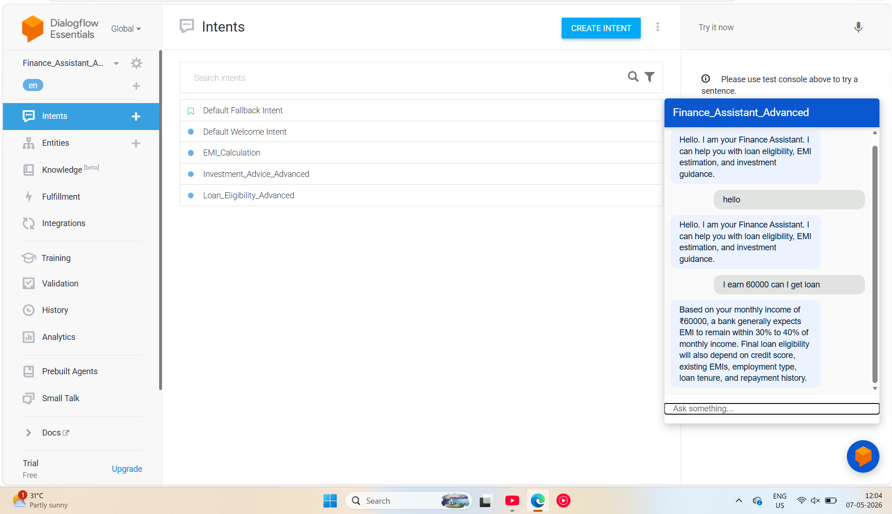
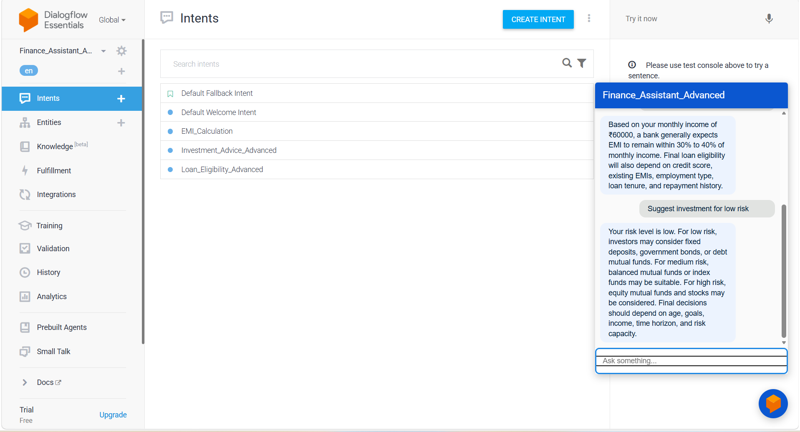

**Advanced Dialogflow Chatbot: Loan + Investment Assistant

Project Overview**

This project demonstrates an advanced finance chatbot built on Dialogflow ES to assist users with three common personal finance needs: loan eligibility guidance, EMI estimation, and investment suggestions based on risk level.

The chatbot is designed as a no-code conversational AI solution for finance education and customer support simulation. It helps students understand how natural language processing can be applied in banking and investment use cases.

**Business Problem**

Traditional customer support in finance often depends on manual interaction for basic queries such as loan eligibility, EMI-related questions, and investment guidance. This creates several challenges:

Repetitive handling of common customer questions

Slow response time for simple financial queries

Limited availability of human support teams

Inconsistent user experience across interactions

Lack of scalable self-service finance assistance

This project solves the problem by creating a chatbot that can respond instantly to finance-related user inputs and simulate a basic digital finance assistant.

**Project Structure**

text
Advanced-Dialogflow-Chatbot/
│
├── intents/
│   ├── Loan_Eligibility_Advanced
│   ├── EMI_Calculation
│   └── Investment_Advice_Advanced
│
├── entities/
│   └── risk_level
│
├── screenshots/
│   ├── agent_name.png
│   ├── intent_list.png
│   ├── training_phrases.png
│   ├── parameters_section.png
│   └── chatbot_test_conversation.png
│
└── README.md

Key Features

Loan eligibility intent using monthly income as input

EMI calculation intent for loan amount queries

Investment advice intent using custom risk-level classification

Use of Dialogflow system entity @sys.number for numeric finance inputs

Custom entity risk_level with low, medium, and high categories

Welcome intent for product introduction

Fallback intent for unsupported finance queries

Chat simulator testing for real-time bot interaction

No-code implementation suitable for student learning and demo projects

## 📸 Screenshots

### 1. Dialogflow

---

### 2. Dialog flow

**How to Run**

Open Dialogflow and sign in with Gmail.

Create a new agent named Finance_Assistant_Advanced.

Set the language to English and time zone to Asia/Kolkata.

Create the following intents:

Loan_Eligibility_Advanced

EMI_Calculation

Investment_Advice_Advanced

Add training phrases and configure parameters using @sys.number for income and loan amount.

Create a custom entity named risk_level with values such as low, medium, and high.

Add suitable responses for loan, EMI, and investment queries.

Update the default welcome and fallback intents.

Test the chatbot in the Dialogflow simulator using sample finance questions.

Capture screenshots of the agent, intents, parameters, and chatbot conversations for submission.

**Conclusion**

This project shows how a no-code chatbot can be used to automate basic financial guidance in areas such as loans, EMI estimation, and investment suggestions. It demonstrates the practical use of conversational AI in digital finance transformation and helps students understand how intelligent virtual assistants can improve customer engagement in banking and financial services.

**Author**

Divyam Narang

MBA Finance Student | AI in Finance Practitioner
